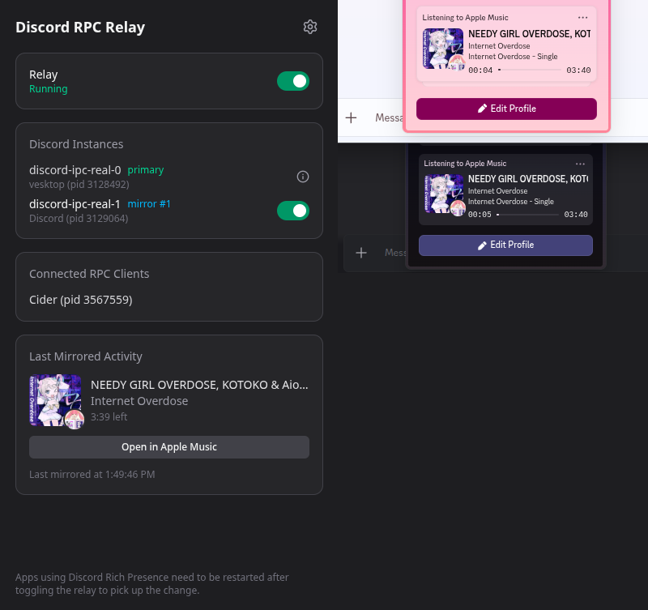

# 🪩 Discord-RPC-Relay



Mirrors Discord Rich Presence (RPC) activity to every running Discord
instance (stable, PTB, Canary, ...), so apps that only connect to the
primary `discord-ipc-0` socket show their presence everywhere.

It works by taking over `discord-ipc-0`, passing all traffic through to the
real primary instance unchanged, and forwarding the handshake and
`SET_ACTIVITY` frames to the other detected instances.

Linux and macOS only.

## Install

Download the latest build for your platform from the
[Releases page](https://github.com/YuzuZensai/Discord-RPC-Relay/releases).

### Linux (AppImage)

1. Download `discord-rpc-relay-<version>.AppImage`.
2. Make it executable and run it:

   ```bash
   chmod +x discord-rpc-relay-*.AppImage
   ./discord-rpc-relay-*.AppImage
   ```

The app runs from the tray. To launch it automatically and have it appear in
your application menu, move it somewhere permanent (e.g. `~/Applications/`)
and create a desktop entry, or enable "Start on login" from the app's
settings once it's running.

### Linux (.deb)

1. Download `discord-rpc-relay-<version>.deb`.
2. Install it:

   ```bash
   sudo apt install ./discord-rpc-relay-*.deb
   ```

3. Launch it from your application menu ("Discord RPC Relay"), or from a
   terminal:

   ```bash
   discord-rpc-relay
   ```

### macOS

1. Download `discord-rpc-relay-<version>.dmg` and open it.
2. Drag **Discord RPC Relay** into the **Applications** folder.
3. Clear the Gatekeeper quarantine attribute before first launch (see below),
   then open the app from Applications/Launchpad/Spotlight as usual.

The app runs in the menu bar. Subsequent launches don't need the Gatekeeper
step again.

#### macOS Gatekeeper

The macOS build isn't signed/notarized, so Gatekeeper will quarantine it and
refuse to open it ("app is damaged and can't be opened" / "unidentified
developer"). After installing, clear the quarantine attribute from the
Terminal:

```bash
xattr -cr /Applications/Discord\ RPC\ Relay.app
```

Then open the app normally.

## Development

```bash
pnpm install
pnpm dev
```

## Build

```bash
pnpm build:linux
pnpm build:mac
pnpm build:win
```
